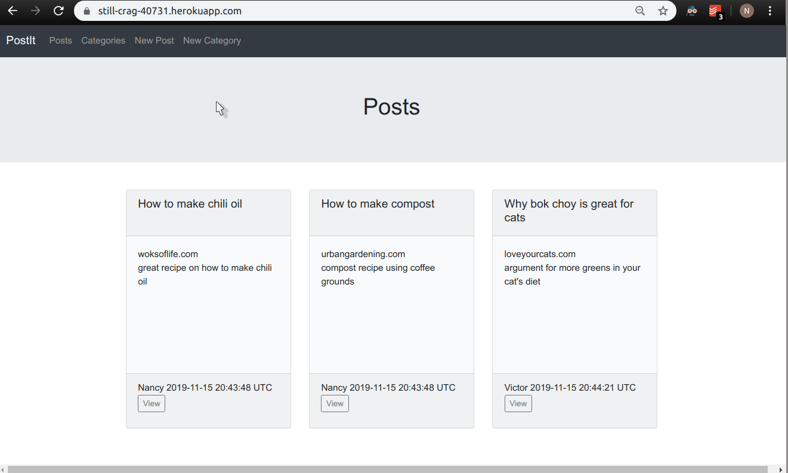
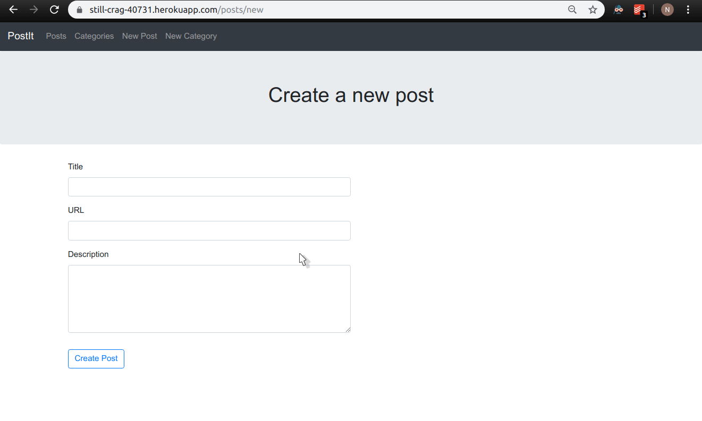
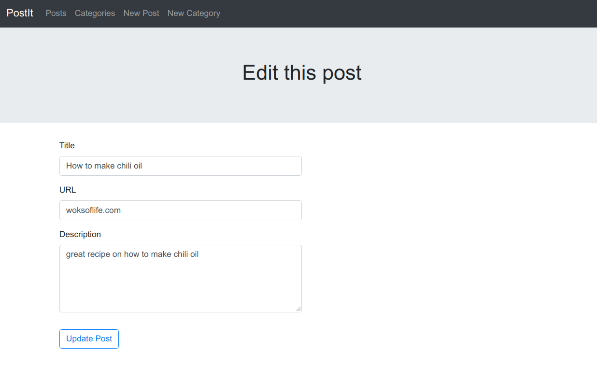
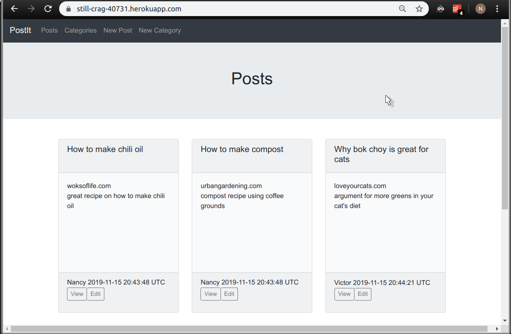

# Lesson 2

### Course Instructions
#### Lecture 3
##### Posts
- Allow a user to create a new post. Use a model-backed form.
- Add the following validations for a new post. Display validation errors in the `new` view.
  - Require `title`, `url`, and `description`.
  - `title` must be at least 5 characters.
  - `url` must be unique.
- Allow a user to update a post. Use a model-backed form.
- Use `before_action` to set up an instance variable needed for the `show`, `edit`, and `update` methods of the posts controller.
- Extract common code used in the `new` and `edit` views to partials.
##### Categories
- Allow a user to create a new category. Use a model-backed form.
- Add the following validations for a new post. Display validation errors in the `new` view.
  - Require `name`.
  - `name` must be unique.
- Extract the part of the category and post forms that displays validation errors to a partial.

### What I Changed
I only show the code with partials, for brevity's sake, since this is the third time I'm returning to this lesson. The course videos show the step-by-step approach, with commentary.

## Table of Contents
* [Lecture 3](#lecture-3)
   * [Create a test user](#create-a-test-user)
   * [Add new and create actions](#add-new-and-create-actions)
   * [Add new views](#add-new-views)
      * [Posts](#posts)
      * [Categories](#categories)
      * [Shared](#shared)
   * [Add links to the new views in the navigation bar](#add-links-to-the-new-views-in-the-navigation-bar)
   * [Display flash messages](#display-flash-messages)
   * [Test your changes and deploy](#test-your-changes-and-deploy)
   * [Add validations](#add-validations)
   * [Display validation errors in new view](#display-validation-errors-in-new-view)
   * [Test your changes and deploy](#test-your-changes-and-deploy-1)
   * [Add edit and update actions for posts](#add-edit-and-update-actions-for-posts)
   * [Add edit view for posts](#add-edit-view-for-posts)
   * [Add links to edit each post](#add-links-to-edit-each-post)
   * [Test your changes and deploy](#test-your-changes-and-deploy-2)

## Lecture 3 

### Create a test user
Run `User.create(username: "Test")` in rails console.

This will serve as the creator of posts created through the `posts#create` action for now. The course covers how to add user authentication in a later lesson.

### Add `new` and `create` actions
```ruby
# app/controllers/posts_controller.rb
  
class PostsController < ApplicationController
  def index
    @posts = Post.all
  end

  def new
    @post = Post.new
  end

  def create
    @post = Post.new(post_params)

    # TODO: set to current user when user authentication is added
    @post.creator = User.find_by username: 'Test' 

    if @post.save
      flash[:notice] = 'Your post was created.'
      redirect_to post_path(@post)
    else
      render :new
    end
  end

  def show
    @post = Post.find(params[:id])
  end

  private

  def post_params
    params.require(:post).permit(:title, :url, :description)
  end
end
```

```ruby
# app/controllers/categories_controller.rb

class CategoriesController < ApplicationController
  def index
    @categories = Category.all
  end

  def new
    @category = Category.new
  end

  def create
    @category = Category.new(category_params)  
    @category.name = @category.name.downcase

    if @category.save
      flash[:notice] = "A new category was created."
      redirect_to categories_path
    else
      render :new 
    end
  end

  def show
    @category = Category.find(params[:id])
  end

  private

  def category_params
    params.require(:category).permit!
  end
end
```

### Add `new` views
- [Note](https://guides.rubyonrails.org/form_helpers.html#using-form-for-and-form-tag): `form_for`, which is used in the course videos, is now [soft-deprecated](https://guides.rubyonrails.org/upgrading_ruby_on_rails.html#upgrading-from-rails-5-0-to-rails-5-1), which means that your code will not break and no deprecation warning will be displayed if you use `form_for`, but it will be removed in the future. It is best to use `form_with` instead, which was introduced in Rails 5.1. 
- [Note](https://guides.rubyonrails.org/v6.0/working_with_javascript_in_rails.html#form-with): `form_with` submits forms using Ajax by default. To display the validation error messages properly, we can disable this behavior by setting the `local` option to `true`, as shown in the code below.

#### Posts 
```
# app/views/posts/new.html.erb
  
<%= render 'shared/header', title: "Create a new post" %>
<%= render 'form' %>
```

```
# app/views/posts/_form.html.erb
  
<section class='container'>
  <%= form_with(model: @post, local: true, html: {autocomplete: 'off'}) do |f| %>
    <div class='form-group'>
      <%= f.label :title %>
      <%= f.text_field :title, class: 'form-control w-50' %>
    </div>
    <div class='form-group'>
      <%= f.label :url, 'URL' %>
      <%= f.text_field :url, class: 'form-control w-50' %>
    </div>
    <div class='form-group'>
      <%= f.label :description %>
      <%= f.text_area :description, rows: 5, class: 'form-control w-50' %>
    </div>
    <%= f.submit(options={class: "btn btn-outline-primary mt-3"}) %>
  <% end %>
</section>
```

#### Categories
```
# app/views/categories/new.html.erb
  
<%= render 'shared/header', title: "Create a new category" %>
<%= render 'form' %>
```

```
# app/views/categories/_form.html.erb
  
<section class='container'>
  <%= form_with(model: @category, local: true, html: {autocomplete: 'off'}) do |f| %>
    <div class='form-group'>
      <%= f.label :name %>
      <%= f.text_field :name, class: 'form-control w-50' %>
    </div>
    <%= f.submit(options={class: "btn btn-outline-primary mt-3"}) %>
  <% end %>
</section>
```

#### Shared


### Add links to the `new` views in the navigation bar
Add the two list items below to `app/views/shared/_nav.html.erb`.
```
<li class='nav-item'>
  <%= link_to 'New Post', new_post_path, class: 'nav-link' %>
</li>
<li class='nav-item'>
  <%= link_to 'New Category', new_category_path, class: 'nav-link' %>
</li>
```

### Display `flash` messages 
- Add `<%= render 'shared/flash' %>` to `app/views/shared/_header.html.erb`.
- Create `flash` partial.
  ```
  # app/views/shared/_flash.html.erb 
  
  <% if flash[:notice] %>
    <div class="alert alert-success">
      <div class="container">
        <%= flash[:notice] %>
      </div>
    </div>
  <% elsif flash[:error] %>
    <div class="alert alert-danger">
      <div class="container">
        <%= flash[:error] %>
      </div>
    </div>
  <% end %>
  ```

### Test your changes and deploy
Remember to create the test user in your production database too.
- `heroku run rails console`
- `User.create(username: 'Test')`

Demo:



### Add validations
```ruby
# app/models/post.rb
  
class Post < ActiveRecord::Base
  belongs_to :creator, class_name: "User", foreign_key: "user_id"
  has_many :comments, dependent: :destroy
  has_many :post_categories, dependent: :destroy
  has_many :categories, through: :post_categories

  validates :title, presence: true, length: {minimum: 5}
  validates :url, presence: true, uniqueness: true
  validates :description, presence: true
end
```
```ruby
# app/models/category.rb

class Category < ApplicationRecord
  has_many :post_categories, dependent: :destroy
  has_many :posts , through: :post_categories

  validates :name, presence: true, uniqueness: true
end
```

### Display validation errors in `new` view
We set the `local` option to `true` in the forms already (see note in [Add new views](#add-new-views), so what we have to do now is render the errors if there are any.

- Add `<%= render 'shared/errors', obj: @post` to `app/views/posts/_form.html.erb`.
- Add `<%= render 'shared/errors', obj: @category` to `app/views/categories/_form.html.erb`.
- Create an errors partial.
  ```
  # app/views/shared/_errors.html.erb
    
  <% if obj.errors.any? %>
    <section class="alert alert-danger">
      <div class="container">
      <h5>Please fix the following errors:</h5>
      <ul>
        <% obj.errors.full_messages.each do |msg| %>
          <li><%= msg %></li>
        <% end %>
      </ul>
      </div>
    </section>
  <% end %>
  ```

### Test your changes and deploy
- Try to submit a new post with inputs that trigger all of the validation errors, then change the inputs incrementally to pass each of the validations in turn.
- Check that the error messages show up in the view as intended.
- Check that the post is created successfully if all validations are satisfied.
- Repeat the above steps for a new category.

Demo:


### Add `edit` and `update` actions for posts
I skip ahead and use `before_action` here to simplify the `show`, `edit`, and `update` actions.
```ruby
# app/controllers/posts_controller.rb

class PostsController < ApplicationController
  before_action :set_post, only: [:show, :edit, :update]

  def index
    @posts = Post.all
  end

  def new
    @post = Post.new
  end

  def create
    @post = Post.new(post_params)

    @post.creator = User.find_by username: 'Test' 

    if @post.save
      flash[:notice] = 'Your post was created.'
      redirect_to post_path(@post)
    else
      render :new
    end
  end

  def show
  end

  def edit
  end

  def update
    if @post.update(post_params)
      flash[:notice] = 'This post was updated.'
      redirect_to post_path(@post)
    else
      render :edit
    end
  end

  private

  def post_params
    params.require(:post).permit(:title, :url, :description)
  end

  def set_post
    @post = Post.find(params[:id])
  end
end
```

### Add `edit` view for posts
- [Note](https://api.rubyonrails.org/v6.0.0/classes/ActionView/Helpers/FormBuilder.html#method-i-submit): In Rails 6, when no value is given for the `submit` method, if the ActiveRecord object is a new record, it will use "Create Post" as the submit button label; otherwise it uses "Update Post". The Launch School videos show an older version of Rails, so they coded this behavior explicitly.

```ruby
# app/views/posts/edit.html.erb 

<%= render 'shared/header', title: 'Edit this post' %>
<%= render 'form' %>
```

### Add links to edit each post
Add this button inside the `nav` in the footer of the post partial: `<%= button_to 'Edit', edit_post_path(post), method: 'get', class: 'btn btn-sm btn-outline-secondary border-left-0' %>`

### Test your changes and deploy
  - Try to update a post with inputs that trigger all of the validation errors, then change the inputs incrementally to pass each of the validations in turn.
  - Check that the error messages show up in the view as intended.
  - Check that the post is updated successfully if all validations are satisfied.

Screenshots of the new post partial look and edit post page:




## Lecture 4

### Instructions
- Change the association name between comments and user to comments and creator.
- Allow a user to create a new comment on a post.
  - The form for a new comment should be displayed on the posts `show` view.
  - The form should be submitted via a POST request to `/posts/:post_id/comments`.
- Add the following validations for a new comment. Display validation errors in the posts `show` view.
  - Require `body`.
- Display all comments related to a post on the posts `show` view.
- Allow a user to associate a post with categories when creating a new post and when editing a post.
- Allow a user to click on post URLs and navigate to those URLs.
- Display timestamps in a format like "11/01/2019 7:01pm UTC".
- Add a link to edit the post on the post `show` view.

### Change the association name and add validation
```ruby
# app/models/comment.rb

class Comment < ApplicationRecord
  belongs_to :creator, class_name: 'User', foreign_key: 'user_id'
  belongs_to :post

  validates :body, presence: true
end
```

### Add `create` action
```ruby
# app/controllers/comments_controller.rb 
  
class CommentsController < ApplicationController
  def create
    @post = Post.find(params[:post_id])

    @comment = @post.comments.new(comment_params)

    # TODO: set to current user when user authentication is added
    @user = User.find_by username: 'Test' 
    @comment.creator = @user

    if @comment.save
      flash[:notice] = 'Your comment was added.'
      redirect_to post_path(@post)
    else
      render 'posts/show'
    end
  end

  private

  def comment_params
    params.require(:comment).permit(:body)
  end
end
```

### Add nested route
```ruby
# config/routes.rb

Rails.application.routes.draw do
  root to: 'posts#index'
  resources :posts, :categories, except: :destroy do
    resources :comments, only: :create
  end
end
```

### Create an new instance of a comment in the posts `show` action
Add `@comment = Comment.new` to the `show` method in `app/controllers/posts_controller.rb`.

### Edit posts `show` view
- Add new comment form.
- Display all comments on the post.

```
# app/views/posts/show.html.erb

<%= render 'shared/header', title: @post.title, post: @post %>

<section class='container justify-content-center'>
  <p><%= simple_format(@post.description) %></p>

  <section class='w-50 pt-5'>
    <%= form_for [@post, @comment] do |f| %>
      <%= render 'shared/errors', obj: @comment %>
      <div class="form-group">
        <%= f.label :body, "Leave a comment" %>
        <%= f.text_area :body, rows: 3, class: "form-control" %>
      </div>
      <%= f.submit "Create comment", class: "btn btn-outline-primary btn-sm" %>
    <% end %>
  </section>

  <section class='py-5'>
    <h5 class='pb-2'>Comments</h5>
    <% if @post.comments.empty? %>
      <p class="text-muted">There aren't any comments for this post.</p>
    <% else %>
      <% @post.comments.each do |comment| %>
        <%= render 'comments/comment', comment: comment %>
      <% end %>
    <% end %>
  </section>
</section>
```

```
# app/views/comments/_comment.html.erb

<article class="card bg-light mb-3" style="max-width: 18rem;">
  <main class="card-body">
    <p class="card-text"><%= comment.body %></p>
  </main>
  
  <footer class='card-footer'>
    <%= "#{comment.creator.username} #{comment.created_at}" %>
  </footer>
</article>
```

### Test your changes and deploy
Demo:


### Allow a user to associate a post with categories
- Note: If you want to mass assign an array, you have to use syntax like this in the permit method: `permit(category_ids: [])` .
- Add the code below to the form in `_form.html.erb`.
  ```
  <%= f.label "Categories" %>
  <%= f.collection_check_boxes :category_ids, Category.all, :id, :name do |cb| %>
    <% cb.label {cb.check_box + cb.text.capitalize} %>
  <% end %>
  ```
- Modify the `post_params` method in `app/controllers/posts_controller.rb`.
  ```
  def post_params
    params.require(:post).permit(:title, :url, :description, category_ids: [])
  end
  ```
### Allow a user to click on post URLs and navigate to those URLs
- Ensure that URLs are prepended with `"http://"` when displayed.
  - Add a helper.
  ```
  # app/helpers/application_helper.rb 

  module ApplicationHelper
    def fix_url(str)
      str.starts_with?("http://") ? str : "http://#{str}"
    end
  end
  ```
  - `app/views/posts/index.html.erb` 
    - Replace `post.url` with `fix_url(post.url)`.
  - `app/views/posts/show.html.erb`
    - Replace `@post.url` with `fix_url(@post.url)`.
- Ensure that the `href` attributes are set to the URLs.
- `app/views/posts/index.html.erb` 
  - Replace `link_to fix_url(post.url)` with `link_to(body=fix_url(post.url), url=fix_url(post.url))`.
- `app/views/posts/show.html.erb`
  - Replace `link_to fix_url(@post.url)` with `link_to(body=fix_url(@post.url), url=fix_url(@post.url))`.

### Display timestamps in a format like "11/01/2019 7:01pm UTC" 
- Note: See Ruby docs for [`strftime`](https://ruby-doc.org/stdlib-2.6.1/libdoc/date/rdoc/DateTime.html#method-i-strftime).
- Add a helper.
  ```
  # app/helpers/application_helper.rb 
  
  module ApplicationHelper
  
    # code omitted for clarity 
  
    def display_datetime(dt)
      dt.strftime("%m/%d/%Y %l:%M%P %Z")
    end
  end
  ```
- `app/views/posts/show.html.erb`
  - Replace `comment.created_at` with `display_datetime(comment.created_at)`.

### Additional styling
- Sort posts in descending order of `created_at`.
