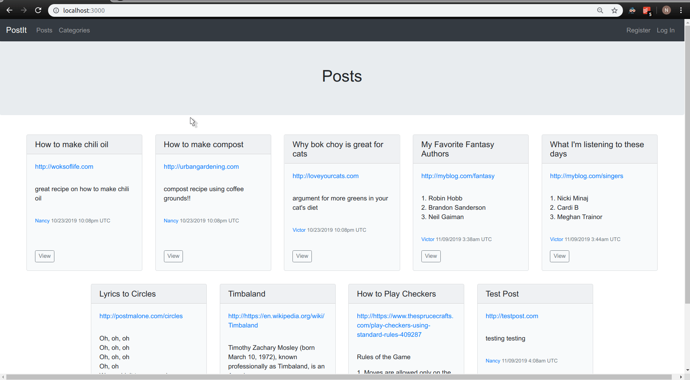

# Lesson 3

## Table of Contents
* [Lecture 5](#lecture-5)
   * [Instructions](#instructions)
   * [Add authentication](#add-authentication)
   * [Add sessions](#add-sessions)
   * [Allow a new user to register](#allow-a-new-user-to-register)
   * [Add Bootstrap styling](#add-bootstrap-styling)
   * [Allow a logged-in user to edit their profile](#allow-a-logged-in-user-to-edit-their-profile)
   * [Prevent users from editing other users' profiles](#prevent-users-from-editing-other-users-profiles)
   * [Display a user's posts and comments on the users show view](#display-a-users-posts-and-comments-on-the-users-show-view)
   * [Link to the show view for a user wherever you have the user name displayed](#link-to-the-show-view-for-a-user-wherever-you-have-the-user-name-displayed)
   * [Demo of user pages](#demo-of-user-pages)

## Lecture 5
### Instructions
- Add authentication
  - Use `has_secure_password` to set up user authentication.
  - Add manual routes to log in and log out.
- Add sessions
  - Add session capability (a user can be logged in or logged out).
  - Add a navigation partial.
    - Always show a link to posts#index and a link to categories#index.
    - If a user is logged in, show a link to create a new post and a link to log out.
    - If a user is not logged in, show a link to register and a link to log in.
  - Prevent non-logged-in users from accessing:
    - All `posts` actions except `show` and `index`
    - All `comments` actions
    - `categories` `new` and `create` actions
  - Prevent non-logged-in users from viewing:
    - The form to create a new comment
    - Links to edit posts
  - Display who created a post and when.
  - Edit the posts and comments controller to set the creator to the current user (instead of test user).
- Allow registration of a new user.
  - Require a username and password.
  - Username must be unique.
  - Password must be at least 5 characters long.
- Allow a logged-in user to edit their own profile.
- Prevent users from editing other users' profiles.
- Display a user's posts and comments on the users `show` view.
- Link to the `show` view for a user wherever you have the user name displayed.
- Add Bootstrap styling.

### Add authentication
- Create a new column to store the password digest. It must be called `password_digest` to conform to Rails convention.
  - `rails g migration add_password_digest_to_users`
  ```ruby
  def change
    add_column :users, :password_digest, :string
  end
  ```
  - `rails db:migrate`
- Add `has_secure_password validations: false` to `app/models/user.rb`
- Add `gem bcrypt` to `Gemfile`. Run `bundle install`.
- Test your changes in `rails console`.
  ```
  user = User.find(1)
  user.password = 'password'
  user.save

  # exit out of rails console and start it again
  user = User.find(1)
  user.password # nil
  user.password_digest # a long string of gibberish
  user.authenticate('hello') # false
  user.authenticate('password') # the user object 
  ```
- Add routes.
  - We follow Rails convention in the naming of the routes.
  - Add the following routes to `config/routes.rb`.
    ```ruby
    get '/login', to: 'sessions#new'
    post '/login', to: 'sessions#create'
    get '/logout', to: 'sessions#destroy'
    ```

- Add a SessionsController.
  ```ruby
  # app/controllers/sessions_controller.rb

  class SessionsController < ApplicationController
    def new
    end

    def create
    end

    def destroy
    end
  end
  ```
- Add a view.
  - We are not using model-backed form helpers because sessions is not a resource.
  ```ruby
  # app/views/sessions/new.html.erb

  <h5>Log In</h5>
  <div>
    <%= form_tag(url: '/login', local: true) do %>
      <div>
        <%= label_tag :username %>
        <%= text_field_tag :username %>
      </div>
      <div>
        <%= label_tag :password %>
        <%= password_field_tag :password %>
      </div>
      <%= submit_tag 'Login' %>
    <% end %>
  </div>
  ```
  - Navigate to `localhost:3000/login` and verify that the form is displayed.

### Add sessions
- Edit sessions controller.
  ```ruby
  # app/controllers/sessions_controller.rb 

  class SessionsController < ApplicationController
    def new
    end

    def create
      user = User.find_by(username: params[:username])
      if user && user.authenticate(params[:password])
        session[:user_id] = user.id
        flash[:notice] = "Welcome, you've logged in."
        redirect_to root_path
      else
        flash.now[:error] = "There is something wrong with your username or password."
        render :new
      end
    end
    
    def destroy
      session[:user_id] = nil
      redirect_to root_path
    end
  end
  ```
- Edit application controller.
  - Note: `||=` is used to prevent multiple database queries from being made in one request. The rest of the statement is not executed if `@current_user` is truthy. This technique is known as memoization. 
  - Note: `helper_method` makes the methods available in all of the controllers and view templates.
  ```ruby
  # app/controllers/application_controller.rb

  class ApplicationController < ActionController::Base
    helper_method :current_user, :logged_in?
    
    def current_user
      @current_user ||= User.find(session[:user_id]) if session[:user_id]
    end
    
    def logged_in?
      !!current_user
    end
  end
  ```
- Edit views.
  - Add navigation partial.
    ```
    # app/views/shared/_nav.html.erb

    <nav>
      <ul>
        <li><%= link_to "Posts", posts_path %>
        <li><%= link_to "Categories", categories_path %>
    
        <% if logged_in? %>
          <li><%= link_to "New Post", new_post_path %>
          <li><%= link_to "Log Out", logout_path %>
        <% else %>
          <li><%= link_to "Log In", login_path %>
        <% end %>
      </ul>
    </nav>
    ```
  - Add header partial.
    ```
    # app/views/shared/_header.html.erb

    <%= render 'shared/nav' %>
    <h1><%= title %></h1>
    ```
  - Edit all views to use the header partial. For example, add `<%= render 'shared/header', title: "Log In" %>` to `app/views/sessions/new.html.erb`.
- Restrict certain actions to logged-in users.
  - Add a `require_user` method to `app/controllers/application_controller.rb`.
    ```ruby
    def require_user
      if !logged_in?
        flash[:error] = "Must be logged in to do that."
        redirect_to root_path
      end
    end
    ```
  - Prevent non-logged-in users from accessing:
    - All `posts` actions except `show` and `index`: Add `before_action :require_user, except [:show, :index]` to `app/controllers/posts_controller.rb`.
    - All `comments` actions: Add `before_action :require_user` to `app/controllers/comments_controller.rb`.
    - `categories` `new` and `create` actions: Add `before_action :require_user, only: [:new, :create]` to `app/controllers/categories_controller.rb`.
  - Prevent non-logged-in users from viewing:
    - The form to create a new comment: Wrap the form in `<% if logged_in? %>` and `<% end %>`.
    - Links to edit posts: Wrap the links in `<% if logged_in? %>` and `<% end %>`.
  - Display who created a post and when: Add `Created by: <%= @post.creator.username %> at <%= display_datetime(@post.created_at) %>` to `app/views/posts/show.html.erb`.
- Edit the posts and comments controller to set the creator to the current user (instead of test user): `@post.creator = current_user`
- Check your changes.
  - Verify that you can log in and log out.
  - Verify that certain parts of the UI only show up if the user is logged in.
  - Verify that users cannot access certain routes (e.g., `localhost:3000/posts/new`) unless they are logged in.
  - Verify that the logged_in user's name is displayed when a new post is created.
  - Verify that the logged_in user's name is displayed when a new comment is created.

### Allow a new user to register
- Edit `config/routes.rb`.
  - Add `resources :users, only: [:show, :create, :edit, :update]`.
  - Add `get '/register', to: 'users#new'`.
- Add validations to `app/models/post.rb` 
  ```ruby
  validates :username, presence: true, uniqueness: true
  validates :password, presence: true, on: create, length: {minimum: 5}
  ```
- Add actions to users controller.
  ```ruby
  class UsersController < ApplicationController
    def new
      @user = User.new
    end
    
    def create
      @user = User.new(user_params)
    
      if @user.save
        session[:user_id] = @user.id
        flash[:notice] = "You are registered."
        redirect_to root_path
      else
        render :new
      end
    end
    
    private
    
    def user_params
      params.require(:user).permit(:username, :password)  
    end
  end
  ```
- Add `new` view.
  ```
  # app/views/users/new.html.erb
  
  <%= render 'shared/header', title: "Register" %>
  
  <%= form_with(model: @user, local: true) do |f| %>
    <%= render 'shared/errors', obj: @user %>
    <div>
      <%= f.label :username %>
      <%= f.text_field :username %>
    </div>
    <div>
      <%= f.label :password %>
      <%= f.password_field :password %>
    </div>
    <%= f.submit "Register" %>
  <% end %>
  ```
- If user is not logged in, display link to register.
  - Add `<%= link_to 'Register', register_path %>` to `app/views/shared/_nav.html.erb`.
- Check your changes.
  - Register a new user. Trigger the uniqueness validation first.
  - Verify that you are automatically logged in as the new user upon creation.
  - Create a new post and a new comment as the new user. Check that the creator is displayed correctly. 

### Add Bootstrap styling
At this point, I give in and finally add styling using [Bootstrap](https://getbootstrap.com/) to my application. I style my app differently than the instructors do. I referred to [this article](https://medium.com/@biancapower/how-to-add-bootstrap-4-to-a-rails-5-app-650118459a1e) for help with installation. I could not get the dropdowns on the navigation bar to work correctly, though, so my configuration may be incorrect.

After styling, my app looks like this:


### Allow a logged-in user to edit their profile
- Add the following to users controller.
  ```ruby
  before_action :set_user, only: [:show, :edit, :update]
  
  def edit
  end
  
  def update
    if @user.update(user_params)
      flash[:notice] = "Your profile was updated."
      redirect_to user_path(@user)
    else
      render :edit
    end
  end
  
  private
  
  def set_user
    @user = User.find(params[:id])
  end
  ```
- Add a `show` view with a link to the `edit` view.
  ```
  # app/views/users/show.html.erb
  
  <%= render 'shared/header', title: current_user.username, user: true %>
  ```

  ```
  # app/views/shared/_header.html.erb
  
  <% post ||= nil %>
  <% user ||= nil %>
  
  <%= render 'shared/nav' %>
  <section class='jumbotron text-center'>
    <h1 class='jumbotron-heading'><%= title %></h1>
    <% if post %>
      <%= render 'post_url', post: post %>
      <%= render 'shared/creator_details', obj: post %>
    <% elsif user %>
      <%= link_to 'Edit', edit_user_path(current_user.id) %>
    <% end %>
  </section>
  <%= render 'shared/flash' %>
  ```
- Extract the form for a new user to a partial; use the same form for the edit view. The submit button should display `"Update Profile"` in the `edit` view, and `"Register"` in the `new` view: `f.submit(@user.newrecord? ? "Register" : "Update Profile")`
- Check your changes.
  - Log in. Edit the username. Check that the new name shows up in posts and comments created by the user.
  - Edit the password. Log out, then check that you can log back in using the new username and password.

### Prevent users from editing other users' profiles
- Add the following to `app/controllers/users_controller.rb`.
  ```ruby
  before_action :require_same_user, only: [:edit, :update]
  
  def require_same_user
    if current_user != @user
      flash[:error] = 'You are not allowed to do that.'
      redirect_to root_path
    end
  end
  ```
- Check your changes: Log in as one user and attempt to access the edit page of another user.

### Display a user's posts and comments on the users `show` view 
- Edit `show` view.
  ```
  # app/views/users/show.html.erb
  
  <%= render 'shared/header', title: @user.username, user: @user == current_user %>
  
  <section class='container'>
    <% number_of_posts = @user.posts.empty? ? 0 : @user.posts.size %>
    <% number_of_comments = @user.comments.empty? ? 0 : @user.comments.size %>
    
    <ul class='nav nav-tabs'>
      <li class='nav-item'>
        <%= link_to "Posts (#{number_of_posts})", user_path(@user), class: 'nav-link' %>
      </li>
      <li class='nav-item'>
        <%= link_to "Comments (#{number_of_comments})", user_path(@user, tab: 'comments'), class: 'nav-link' %>
      </li>
    </ul>
    
    <% if params[:tab].nil? %>
      <% if @user.posts.empty? %>
        <p class="text-muted">There aren't any posts for this user.</p>
      <% else %>
        <% @user.posts.each do |post| %>
          <%= render 'posts/post', post: post %>
        <% end %>
      <% end %>
    <% elsif params[:tab] == 'comments' %>
      <% if @user.comments.empty? %>
        <p class="text-muted">There aren't any comments for this user.</p>
      <% else %>
        <% @user.comments.each do |comment| %>
          <%= render 'comments/comment', comment: comment, show_post: true %>
        <% end %>
      <% end %>
    <% end %>
  </section>
  ```
- Extract and edit comment partial.
  ```
  # app/views/comments/_comment.html.erb
  
  <% show_post ||= false %>
  
  <article class="card bg-light mb-3" style="max-width: 18rem;">
    <div class="card-body">
      <p class="card-text"><%= comment.body %></p>
      <small class='text-muted'>
      <% if show_post %>
        <%= link_to comment.post.title, post_path(comment.post) %>
      <% end %>
      </small>
      <%= render 'shared/creator_details', obj: comment %>
    </div>
  </article>
  ```
  ```
  # app/views/posts/show.html.erb
  
  <%= render 'shared/header', title: @post.title, post: @post %>
  
  <section class='container justify-content-center'>
    <p><%= simple_format(@post.description) %></p>
    
    <% if logged_in? %>
      <section class='w-50 pt-5'>
        <%= form_for [@post, @comment] do |f| %>
          <%= render 'shared/errors', obj: @comment %>
          <div class="form-group">
            <%= f.label :body, "Leave a comment" %>
            <%= f.text_area :body, rows: 3, class: "form-control" %>
          </div>
          <%= f.submit "Create comment", class: "btn btn-outline-primary btn-sm" %>
        <% end %>
      </section>
    <% end %>
    
    <section class='py-5'>
      <h5 class='pb-2'>Comments</h5>
      <% if @post.comments.empty? %>
        <p class="text-muted">There aren't any comments for this post.</p>
      <% else %>
        <% @post.comments.each do |comment| %>
          <%= render 'comments/comment', comment: comment %>
        <% end %>
      <% end %>
    </section>
  </section>
  ```
### Link to the `show` view for a user wherever you have the user name displayed
```
# app/views/shared/_creator_details.html.erb

<p><small class="text-muted"><%= link_to(obj.creator.username, user_path(obj.creator.id)) + " #{display_datetime(obj.created_at)}" %></small></p>
```

### Demo of user pages


## Lecture 6
### Instructions
- Allow logged-in users to upvote or downvote once per post and comment. Each vote must belong to a user, and must belong to either a post or a comment.
- Create the routes for the votes as follows:
  - `POST /posts/:post_id/vote => posts#vote`
  - `POST /posts/:post_id/comments/:comment_id/vote => comments#vote`

### Create vote model
- Create table.
  - `rails g migration create_votes`
  ```ruby

  class CreateVotes < ActiveRecord::Migration[6.0]
    def change
      create_table :votes do |t|
        t.boolean :vote
        t.belongs_to :user
        t.string :voteable_type
        t.integer :voteable_id
        t.timestamps
      end
  
      add_index :votes, [:voteable_type, :voteable_id]
    end
  end
  ```
  - `rails db:migrate`
- Define model.
  ```ruby
  # app/models/vote.rb 
  
  class Vote < ApplicationRecord
    belongs_to :creator, class_name: 'User', foreign_key: 'user_id'
    belongs_to :voteable, polymorphic: true
  end
  ```
- Set up polymorphic association in `app/models/post.rb` and `app/models/comment.rb`.
  `has_many :votes, as: :voteable`
- Check your changes in `rails console`.
  ```
  # Create a new vote: user 1 upvoted on post 2.
  Vote.create(user_id: 1, vote: true, voteable_type: 'Post', voteable_id: 2)
  
  # Create a new vote: user 1 upvoted on comment 1.
  Vote.create(user_id: 1, vote: true, voteable_type: 'Comment', voteable_id: 1)
  
  # Create a new vote: user 2 downvoted on post 2.
  Vote.create(user_id: 2, vote: false, voteable_type: 'Post', voteable_id: 2)
  
  pp Post.find(2).votes # should print two votes
  pp Comment.find(1).votes # should print one vote
  pp User.find(1).votes # should print two votes 
  pp User.find(2).votes # should print one vote 
  ```

### Create vote routes 
Modify the post routes block in `config/routes.rb` to the following.
```ruby
resources :posts, except: :destroy do
  member do
    post 'vote'
  end

  resources :comments, only: :create
end
```

### Allow a user to vote on a post 
- Add up arrows and down arrows that trigger the vote actions.
  ```
  # app/views/posts/_post.html.erb 
  
  <aside class='col-md-2 votes text-center'>
    <%= link_to vote_post_path(post, vote: true), method: 'post' do %>
      <%= fa_icon 'arrow-up' %>
    <% end %>
    </br>
    <%= post.total_votes %>
    </br>
    <%= link_to vote_post_path(post, vote: false), method: 'post' do %>
      <%= fa_icon 'arrow-down' %>
    <% end %>
  </aside>
  ```
- Define a `vote` action in PostsController.
  ```ruby
  # app/controllers/posts_controller.rb
  
  before_action :set_post, only: [:show, :edit, :update, :vote]
  
  def vote
    Vote.create(voteable: @post, creator: current_user, vote: params[:vote])
    redirect_to posts_path
  end
  ```

### Display total votes on a post
- Define instance methods on the Post model.
  ```ruby
  # app/models/post.rb 
  
  def total_votes
    self.upvotes - self.downvotes  
  end
  
  def upvotes
    self.votes.where(vote: true).size
  end
  
  def downvotes
    self.votes.where(vote: false).size
  end
  ```
- Add `<%= post.total_votes %>` to `app/views/posts/_post.html.erb`.
