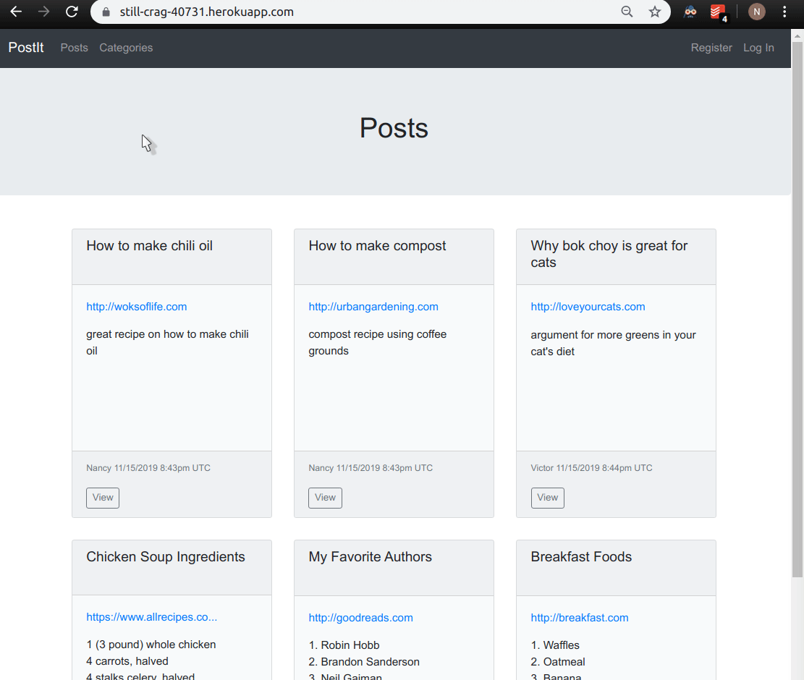
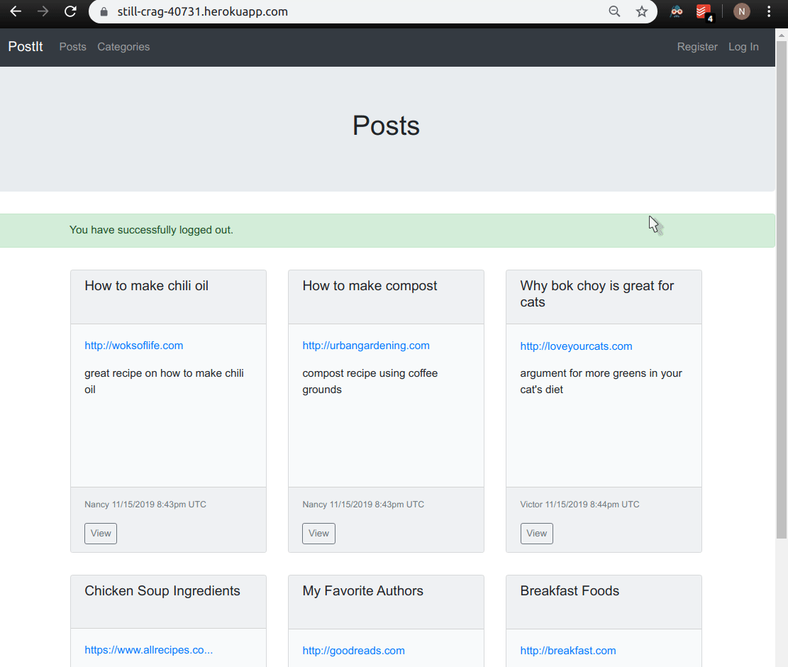
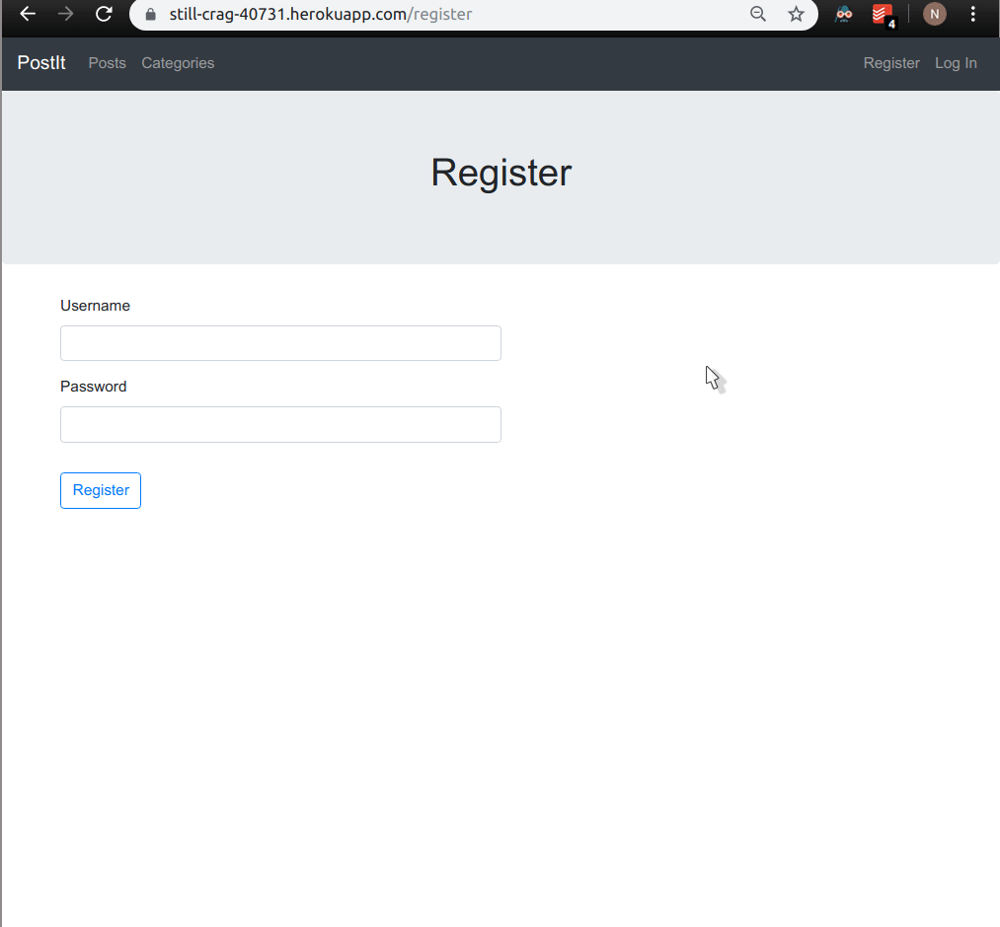
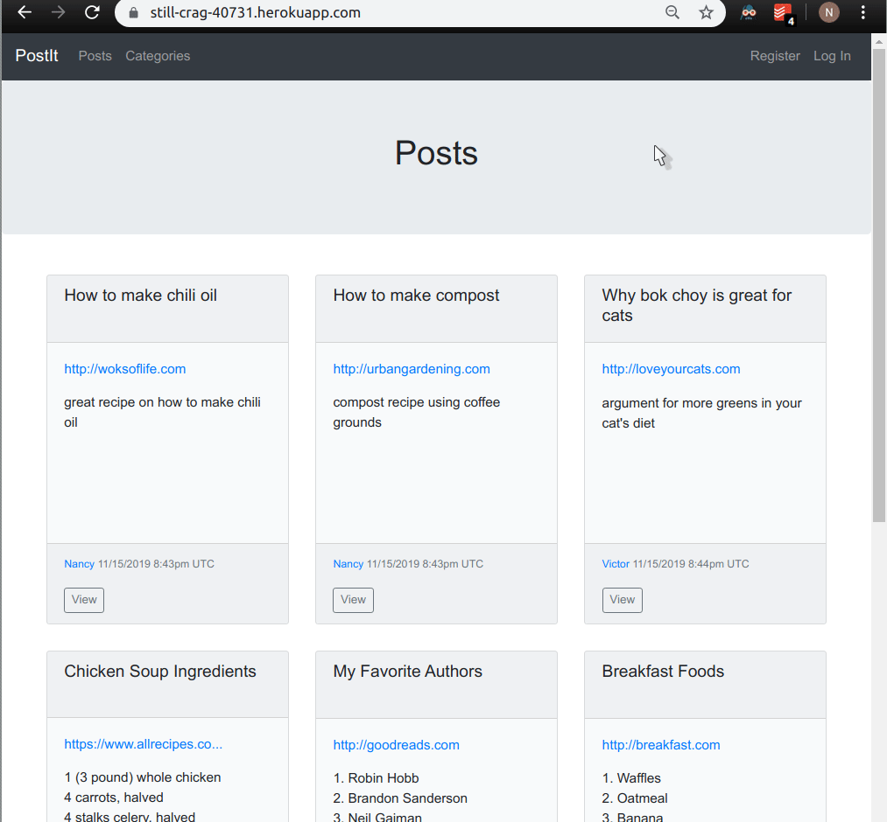
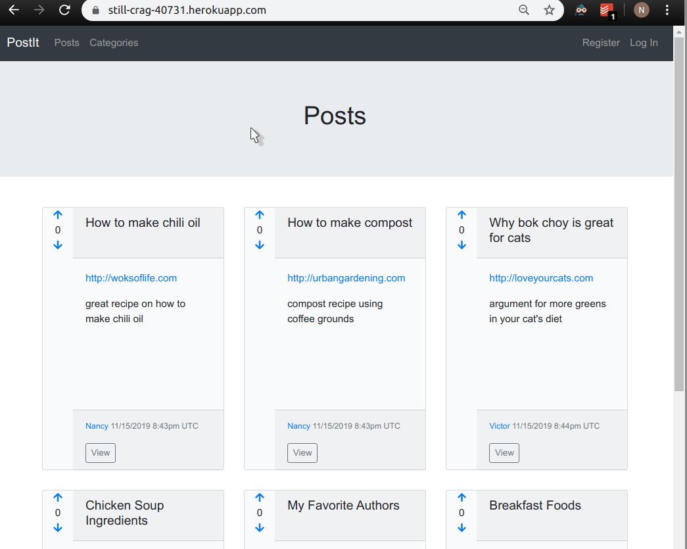

# Lesson 3
At the end of the lesson, the app will allow a user to register with a username and password, log in, log out, and vote on posts and comments. Certain actions and parts of the UI will be restricted to logged-in users. Logged-in users will be restricted from editing other users' profiles and posts that other users have created. 

Demo:


## Table of Contents
* [Course Instructions](#course-instructions)
   * [Lecture 5](#lecture-5)
      * [Sessions](#sessions)
      * [Users](#users)
   * [Lecture 6](#lecture-6)
   * [What I Changed](#what-i-changed)
   * [What I Added](#what-i-added)
* [Lecture 5](#lecture-5-1)
   * [Add password attribute to users](#add-password-attribute-to-users)
   * [Sessions](#sessions-1)
      * [Add routes to log in and log out](#add-routes-to-log-in-and-log-out)
      * [Add helper methods](#add-helper-methods)
      * [Add session actions](#add-session-actions)
      * [Add view to log in](#add-view-to-log-in)
      * [Edit navigation bar](#edit-navigation-bar)
      * [Prevent non-logged-in users from viewing certain elements](#prevent-non-logged-in-users-from-viewing-certain-elements)
      * [Prevent non-logged-in users from performing certain actions](#prevent-non-logged-in-users-from-performing-certain-actions)
      * [Set the creator of posts and comments to the current user (instead of test user)](#set-the-creator-of-posts-and-comments-to-the-current-user-instead-of-test-user)
      * [Check your changes](#check-your-changes)
      * [Deploy](#deploy)
      * [Demo](#demo)
   * [Users](#users-1)
      * [Add routes to support all user actions except index and destroy](#add-routes-to-support-all-user-actions-except-index-and-destroy)
      * [Add validations for a new user](#add-validations-for-a-new-user)
      * [Add users controller](#add-users-controller)
   * [Prevent users from editing other users' posts](#prevent-users-from-editing-other-users-posts)
      * [Add user registration and edit view](#add-user-registration-and-edit-view)
      * [Add users show view](#add-users-show-view)
      * [Link to the show view for a user wherever you have the user name displayed](#link-to-the-show-view-for-a-user-wherever-you-have-the-user-name-displayed)
      * [Update the user-related links in the navigation bar](#update-the-user-related-links-in-the-navigation-bar)
      * [Check your changes and deploy](#check-your-changes-and-deploy)
      * [Demos](#demos)
* [Lecture 6](#lecture-6-1)
   * [Add routes to vote on a post or comment](#add-routes-to-vote-on-a-post-or-comment)
   * [Create votes polymorphic table](#create-votes-polymorphic-table)
   * [Create votes model](#create-votes-model)
   * [Set up polymorphic association](#set-up-polymorphic-association)
   * [Track the total votes per post and per comment](#track-the-total-votes-per-post-and-per-comment)
   * [Check your changes in rails console](#check-your-changes-in-rails-console)
   * [Add voting feature to the UI](#add-voting-feature-to-the-ui)
   * [Add vote actions to posts and comments controllers](#add-vote-actions-to-posts-and-comments-controllers)
   * [Deploy](#deploy-1)

Created by [gh-md-toc](https://github.com/ekalinin/github-markdown-toc)

## Course Instructions
### Lecture 5
- Use `has_secure_password` to set up user authentication.
#### Sessions
- Allow a user to log in and log out. Use these custom routes:
  ```
  get '/login', to: 'sessions#new'
  post '/login', to: 'sessions#create'
  get '/logout', to: 'sessions#destroy'
  ```
- Add view to log in.
- Edit navigation bar.
  - Always show links to all posts and all categories.
  - If a user is not logged in, show links to:
    - Register
    - Log in
  - If a user is logged in, show links to:
    - Create a new post
    - Create a new category
    - Log out
    - View the user's own profile
- Prevent non-logged-in users from viewing:
  - The form to create a new comment
  - Links to edit posts
- Prevent non-logged-in users from accessing:
  - All `posts` actions except `show` and `index`
  - All `comments` actions
  - `categories` `new` and `create` actions
- Edit the posts and comments controller to set the creator to the current user (instead of test user).
#### Users
- Add routes to support all user actions except `index` and `destroy`. Use the `'/register'` route for `users#new`.
- Add the following validations for a new user:
  - Require a username and password.
  - Username must be unique.
  - Password must be at least 5 characters long.
- Prevent users from editing other users' profiles and other users' posts.
- Display a user's posts and comments in the users `show` view.
- Add a link to edit the user's profile in the users `show` view. 
- Link to the `show` view for a user wherever you have the user name displayed.
- Update the user-related links in the navigation bar.
### Lecture 6 
- Allow logged-in users to upvote or downvote once per post and comment. Each vote must belong to a user, and must belong to either a post or a comment.
- Display the total votes per post and per comment in the UI (total votes = number of upvotes - number of downvotes).
- Create the routes for the votes as follows:
  - `POST /posts/:post_id/vote => posts#vote`
  - `POST /posts/:post_id/comments/:comment_id/vote => comments#vote`

### What I Changed
I sort the posts in decreasing order of their `created_at` timestamp instead of by total votes. I found it disconcerting to vote on a post and find that post has moved to another area on the page. I added this functionality in [Lesson 2](https://github.com/nantrinh/ls_rails_notes/tree/master/lesson_2#additional-styling). 

### What I Added
- Disable voting and gray out the arrow corresponding to the vote the user has made on the comment or post. 
- Allow a user to change their vote on a comment or post. (I update the appropriate row in the votes table when the user changes their vote ; no additional rows are created).
- Extract the voting functionality to a partial.

## Lecture 5
### Add password attribute to users 
- Create a new column to store the password digest. It must be called `password_digest` to conform to Rails convention.
  - `rails g migration add_password_digest_to_users`
  ```ruby
  def change
    add_column :users, :password_digest, :string
  end
  ```
  - `rails db:migrate`
- Add `has_secure_password validations: false` to `app/models/user.rb`
- Add `gem bcrypt` to `Gemfile`. Run `bundle install`.
- Test your changes in `rails console`.
  ```
  user = User.find(1)
  user.password = 'password'
  user.save

  # exit out of rails console and start it again
  user = User.find(1)
  user.password # nil
  user.password_digest # a long string of gibberish
  user.authenticate('hello') # false
  user.authenticate('password') # the user object 
  ```

### Sessions
#### Add routes to log in and log out
Use the custom routes specified in the course. We follow Rails convention in the naming of the routes.

Add the following routes to `config/routes.rb`.
```ruby
get '/login', to: 'sessions#new'
post '/login', to: 'sessions#create'
get '/logout', to: 'sessions#destroy'
```

#### Add helper methods
- Note: `||=` is used to prevent multiple database queries from being made in one request. The rest of the statement is not executed if `@current_user` is truthy. This technique is known as memoization. 
- Note: `helper_method` makes the methods available in all of the controllers and view templates.
```ruby
# app/controllers/application_controller.rb

class ApplicationController < ActionController::Base
  helper_method :current_user, :logged_in?
  
  def current_user
    @current_user ||= User.find(session[:user_id]) if session[:user_id]
  end
  
  def logged_in?
    !!current_user
  end

  def require_user
    if !logged_in?
      flash[:error] = "You must be logged in to do that."
      redirect_to root_path
    end
  end
end
```

#### Add session actions 
```ruby
# app/controllers/sessions_controller.rb

class SessionsController < ApplicationController
  def new
  end

  def create
    user = User.find_by(username: params[:username])
    if user && user.authenticate(params[:password])
      session[:user_id] = user.id
      flash[:notice] = "Welcome, you've logged in."
      redirect_to root_path
    else
      flash.now[:error] = "There is something wrong with your username or password."
      render :new
    end
  end
  
  def destroy
    session[:user_id] = nil
    flash[:notice] = "You have successfully logged out."
    redirect_to root_path
  end
end
```

#### Add view to log in
```ruby
# app/views/sessions/new.html.erb

<%= render 'shared/header', title: "Log In" %>
<div class='container'>
  <%= form_with(url: '/login', local: true, html: {autocomplete: 'off'}) do %>
    <div class='form-group'>
      <%= label_tag 'username' %>
      <%= text_field_tag(name='username', value='', options={class: 'form-control w-50'}) %>
    </div>
    <div class='form-group'>
      <%= label_tag :password %>
      <%= password_field_tag(name='password', value='', options={class: 'form-control w-50'}) %>
    </div>
    <%= submit_tag(value='Login', options={class: "btn btn-outline-primary mt-3"})%>
  <% end %>
</div>
```

#### Edit navigation bar
- Always show links to all posts and all categories.
- If a user is not logged in, show links to:
  - Register (set url to '' for now)
  - Log in
- If a user is logged in, show links to:
  - Create a new post
  - Create a new category
  - Log out
  - View the user's own profile (set url to '' for now)

Update the links section of `app/views/shared/_nav.html.erb` to the following:
```
<!-- Links -->
<ul class='navbar-nav'>
  <li class='nav-item'>
    <%= link_to 'Posts', posts_path, class: 'nav-link' %>
  </li>
  <li class='nav-item'>
    <%= link_to 'Categories', categories_path, class: 'nav-link' %>
  </li>
  <% if logged_in? %>
    <li class='nav-item'>
      <%= link_to 'New Post', new_post_path, class: 'nav-link' %>
    </li>
    <li class='nav-item'>
      <%= link_to 'New Category', new_category_path, class: 'nav-link' %>
    </li>
  <% end %>
</ul>

<ul class='navbar-nav flex-row ml-md-auto d-none d-md-flex'>
  <% if logged_in? %>
    <li class='nav-item'>
      <%= link_to 'Log Out', logout_path, class: 'nav-link' %>
    </li>
    <li>
      <%= link_to 'Profile', '', class: 'nav-link text-right' %>
    </li>
  <% else %>
    <li class='nav-item'>
      <%= link_to 'Register', '', class: 'nav-link' %>
    </li>
    <li class='nav-item'>
      <%= link_to 'Log In', login_path, class: 'nav-link' %>
    </li>
  <% end %>
</ul>
```

#### Prevent non-logged-in users from viewing certain elements
- The form to create a new comment
- Links to edit posts

Wrap the pertinent code in `<% if logged_in %>; <% end %>` tags.
```
# app/views/posts/show.html.erb

<% if logged_in? %>
  <section class='w-50 pt-5'>
    <%= form_for [@post, @comment] do |f| %>
      <%= render 'shared/errors', obj: @comment %>
      <div class="form-group">
        <%= f.label :body, "Leave a comment" %>
        <%= f.text_area :body, rows: 3, class: "form-control" %>
      </div>
      <%= f.submit "Create comment", class: "btn btn-outline-primary btn-sm" %>
    <% end %>
  </section>
<% end %>
```

```
# app/views/posts/_post.html.erb

<% if current_user == post.creator %>
  <%= button_to 'Edit', edit_post_path(post), method: 'get', class: 'btn btn-sm btn-outline-secondary border-left-0' %>
<% end %>
```

#### Prevent non-logged-in users from performing certain actions
- All `posts` actions except `show` and `index`
- All `comments` actions
- `categories` `new` and `create` actions

Use `before_action :require_user` in the controllers.
```ruby
# app/controllers/posts_controller.rb

before_action :require_user, except: [:show, :index]
```

```ruby
# app/controllers/categories_controller.rb

before_action :require_user, only: [:new, :create]
```

```ruby
# app/controllers/comments_controller.rb

before_action :require_user
```

#### Set the creator of posts and comments to the current user (instead of test user)
Set the creator to current_user in the `create` actions.

```ruby
# app/controllers/posts_controller.rb

@post.creator = current_user
```

```ruby
# app/controllers/comments_controller.rb

@comment.creator = current_user
```

#### Check your changes
- Verify that you can log in and log out.
- Verify that certain users cannot view these parts of the UI unless they are logged in:
  - The form to create a new comment
  - Links to edit posts
- Verify that users cannot perform these actions unless they are logged in:
  - All `posts` actions except `show` and `index`
  - All `comments` actions
  - `categories` `new` and `create` actions
- Verify that the logged_in user's name is displayed when a new post is created.
- Verify that the logged_in user's name is displayed when a new comment is created.

#### Deploy
Remember to run `heroku run rake db:migrate` and manually set a user's password in the rails console in order to do the tests.

#### Demo
When the user is not logged in:


When the user is logged in:


### Users
#### Add routes to support all user actions except `index` and `destroy`
Use the `'/register'` route for `users#new`.
Add the following to `config/routes.rb`:
```ruby
resources :users, only: [:show, :create, :edit, :update]
get '/register', to: 'users#new'
```

#### Add validations for a new user
- Require a username and password.
- Username must be unique.
- Password must be at least 5 characters long.
Add the following to `app/models/user.rb` 
```ruby
validates :username, presence: true, uniqueness: true
validates :password, presence: true, on: :create, length: {minimum: 5}
```

#### Add users controller
The `require_same_user` method is used to prevent users from editing other users' profiles.
```ruby
# app/controllers/users_controller.rb

class UsersController < ApplicationController
  before_action :set_user, only: [:show, :edit, :update]
  before_action :require_same_user, only: [:edit, :update]

  def new
    @user = User.new
  end
  
  def create
    @user = User.new(user_params)
  
    if @user.save
      session[:user_id] = @user.id
      flash[:notice] = 'You are registered.'
      redirect_to root_path
    else
      render :new
    end
  end

  def edit
  end

  def update
    if @user.update(user_params)
      flash[:notice] = 'Your profile was updated.'
      redirect_to user_path(@user)
    else
      render :edit
    end
  end

  private

  def user_params
    params.require(:user).permit(:username, :password)  
  end

  def set_user
    @user = User.find(params[:id])
  end

  def require_same_user
    if current_user != @user
      flash[:error] = 'You are not allowed to do that.'
      redirect_to root_path
    end
  end
end
```

### Prevent users from editing other users' posts
Add the following to `app/controllers/posts_controller.rb`:
```
before_action :require_same_user, only: [:edit, :update]

def require_same_user
  if current_user != @post.creator
    flash[:error] = 'You are not allowed to do that.'
    redirect_to root_path
  end
end
```

#### Add user registration and `edit` view
```
# app/views/users/new.html.erb

<%= render 'shared/header', title: "Register" %>
<%= render 'form' %>
```

```
# app/views/users/edit.html.erb

<%= render 'shared/header', title: "Edit Profile" %>
<%= render 'form' %>
```

```
# app/views/users/_form.html.erb

<div class='container'>
  <%= form_with(model: @user, local: true) do |f| %>
    <%= render 'shared/errors', obj: @user %>
    <div class='form-group'>
      <%= f.label :username %>
      <%= f.text_field :username, class: 'form-control w-50' %>
    </div>
    <div class='form-group'>
      <%= f.label :password %>
      <%= f.password_field :password, class: 'form-control w-50' %>
    </div>
    <%= f.submit(@user.new_record? ? "Register" : "Update Profile", class: "btn btn-outline-primary mt-3")%>
  <% end %>
</div>
```

#### Add users `show` view
- Display a user's posts and comments.
- Add a link to edit the user's profile.
```
# app/views/users/show.html.erb

<%= render 'shared/header', title: @user.username, user: @user == current_user %>

<section class='container'>
  <% number_of_posts = @user.posts.empty? ? 0 : @user.posts.size %>
  <% number_of_comments = @user.comments.empty? ? 0 : @user.comments.size %>
  
  <ul class='nav nav-tabs'>
    <li class='nav-item'>
      <%= link_to "Posts (#{number_of_posts})", user_path(@user), class: 'nav-link' %>
    </li>
    <li class='nav-item'>
      <%= link_to "Comments (#{number_of_comments})", user_path(@user, tab: 'comments'), class: 'nav-link' %>
    </li>
  </ul>
  
  <% if params[:tab].nil? %>
    <% if @user.posts.empty? %>
      <p class="text-muted">There aren't any posts for this user.</p>
    <% else %>
      <% @user.posts.each do |post| %>
        <%= render 'posts/post', post: post %>
      <% end %>
    <% end %>
  <% elsif params[:tab] == 'comments' %>
    <% if @user.comments.empty? %>
      <p class="text-muted">There aren't any comments for this user.</p>
    <% else %>
      <% @user.comments.each do |comment| %>
        <%= render 'comments/comment', comment: comment, show_post: true %>
      <% end %>
    <% end %>
  <% end %>
</section>
```

```
# app/views/shared/_header.html.erb

<% post ||= nil %>
<% user ||= nil %>

<%= render 'shared/nav' %>
<section class='jumbotron text-center'>
  <h1 class='jumbotron-heading'><%= title %></h1>
  <% if post %>
    <%= render 'post_url', post: post %>
    <%= render 'shared/creator_details', obj: post %>
  <% elsif user %>
    <%= link_to 'Edit', edit_user_path(current_user.id) %>
  <% end %>
</section>
<%= render 'shared/flash' %>
```

#### Link to the `show` view for a user wherever you have the user name displayed
```
# app/views/shared/_creator_details.html.erb

<p><small class="text-muted"><%= link_to(obj.creator.username, user_path(obj.creator.id)) + " #{display_datetime(obj.created_at)}" %></small></p>
```
#### Update the user-related links in the navigation bar
Update the profile and register links in `app/views/shared/_nav.html.erb` to the following:
```
<%= link_to 'Profile', user_path(current_user.id), class: 'nav-link text-right' %>
<%= link_to 'Register', register_path, class: 'nav-link' %>
```

#### Check your changes and deploy
- Register a new user. Trigger the validations.
- Verify that you are automatically logged in as the new user upon creation.
- Create a new post and a new comment as the new user. Check that the creator is displayed correctly. 
- Edit the username. Check that the new name shows up in posts and comments created by the user.
- Edit the password. Log out, then check that you can log back in using the new username and password.
- Log in as one user and attempt to access the edit page of another user.

#### Demos
Demo of validations:


Demo of user actions:


## Lecture 6
### Add routes to vote on a post or comment
```ruby
# config/routes.rb

Rails.application.routes.draw do
  root to: 'posts#index'

  resources :categories, except: :destroy

  resources :posts, except: :destroy do
    member do
      post 'vote'
    end

    resources :comments, only: :create do
      member do
        post 'vote'
      end
    end
  end

  resources :users, only: [:show, :create, :edit, :update]

  get '/login', to: 'sessions#new'
  post '/login', to: 'sessions#create'
  get '/logout', to: 'sessions#destroy'
  get '/register', to: 'users#new'
end
```

### Create votes polymorphic table 
`rails g migration create_votes`
```ruby

class CreateVotes < ActiveRecord::Migration[6.0]
  def change
    create_table :votes do |t|
      t.boolean :vote
      t.belongs_to :user
      t.string :voteable_type
      t.integer :voteable_id
      t.timestamps
    end

    add_index :votes, [:voteable_type, :voteable_id]
  end
end
```
`rails db:migrate`


### Create votes model
Use `validates_uniqueness_of` to enforce uniqueness of creator and the voteable object (i.e., each user can only have one vote per voteable object).
```ruby
# app/models/vote.rb 

class Vote < ApplicationRecord
  belongs_to :creator, class_name: 'User', foreign_key: 'user_id'
  belongs_to :voteable, polymorphic: true

  validates_uniqueness_of :creator, scope: :voteable
end
```

### Set up polymorphic association
Add `has_many :votes, as: :voteable` to `app/models/user.rb` `app/models/post.rb` and `app/models/comment.rb`.

### Track the total votes per post and per comment
Add the following methods to `app/models/post.rb` and `app/models/comment.rb`.
```ruby
def total_votes
  self.upvotes - self.downvotes  
end

def upvotes
  self.votes.where(vote: true).size
end

def downvotes
  self.votes.where(vote: false).size
end
```

### Check your changes in `rails console`
```
# Create a new vote: user 1 upvoted on post 2.
Vote.create(user_id: 1, vote: true, voteable: Post.find(2))

# Run the above again. You should see a rollback.

# Create a new vote: user 1 upvoted on comment 1.
Vote.create(user_id: 1, vote: true, voteable: Comment.find(1))

# Run the above again. You should see a rollback.

# Create a new vote: user 2 downvoted on post 2.
Vote.create(user_id: 2, vote: false, voteable: Post.find(2))

# Run the above again. You should see a rollback.

pp Post.find(2).votes # should print two votes
pp Comment.find(1).votes # should print one vote
pp User.find(1).votes # should print two votes 
pp User.find(2).votes # should print one vote 
```

### Add voting feature to the UI 
Add up arrows and down arrows that trigger the vote actions.
```
# app/views/shared/_vote.html.erb 

<% if obj.class == Post %>
  <% url_true = vote_post_path(obj, vote: true) %>
  <% url_false = vote_post_path(obj, vote: false) %>
<% elsif obj.class == Comment %>
  <% url_true = vote_post_comment_path(obj.post, obj, vote: true) %>
  <% url_false = vote_post_comment_path(obj.post, obj, vote: false) %>
<% end %>

<% if !current_user || obj.votes.where(user_id: current_user.id, vote: true).empty? %>
  <%= link_to url_true, method: 'post' do %>
    <%= fa_icon 'arrow-up' %>
  <% end %>
<% else %>
  <%= fa_icon 'arrow-up', class: 'disabled' %>
<% end %>
</br>
<%= obj.total_votes %>
</br>
<% if !current_user || obj.votes.where(user_id: current_user.id, vote: false).empty? %>
  <%= link_to url_false, method: 'post' do %>
    <%= fa_icon 'arrow-down' %>
  <% end %>
<% else %>
  <%= fa_icon 'arrow-down', class: 'disabled' %>
<% end %>
```

Modify the posts partial.
```
# app/views/posts/_post.html.erb

<article class='card bg-light m-3 post'>
  <div class='row no-gutters h-100'>
    <aside class='col-md-2 votes text-center'>
      <%= render 'shared/vote', obj: post %>
    </aside>

    <section class='col-md-10'>
      <header class='card-header'>
        <h5><%= truncate(post.title, length: 50) %></h5>
      </header>
  
      <main class='card-body'>
        <%= render 'posts/post_url', post: post, card: true %>
        <p class='card-text'>
          <%= simple_format(truncate(restrict_newlines(post.description, 5), length: 130)) %>
        </p>
      </main>
  
      <footer class='card-footer'>
        <%= render 'shared/creator_details', obj: post %>
        <nav class='btn-group mt-auto'>
          <%= button_to 'View', post_path(post), method: 'get', class: 'btn btn-sm btn-outline-secondary' %>
          <% if current_user == post.creator %>
            <%= button_to 'Edit', edit_post_path(post), method: 'get', class: 'btn btn-sm btn-outline-secondary border-left-0' %>
          <% end %>
        </nav>
      </footer>
    </section>
  </div>
</article>
```

Modify the comments partial.
```
# app/views/comments/_comment.html.erb

<% show_post ||= false %>

<article class="card bg-light mb-3" style="max-width: 18rem;">
  <div class='row no-gutters h-100'>
    <aside class='col-md-2 votes text-center'>
      <%= render 'shared/vote', obj: comment %>
    </aside>

    <section class='col-md-10'>
      <main class="card-body">
        <p class="card-text"><%= comment.body %></p>
      </main>

        <footer class='card-footer'>
        <small class='text-muted'>
        <% if show_post %>
          <%= link_to comment.post.title, post_path(comment.post) %>
        <% end %>
        </small>
        <%= render 'shared/creator_details', obj: comment %>
        </footer>
  </div>
</article>
```

### Add vote actions to posts and comments controllers
[NOTE](https://guides.rubyonrails.org/5_0_release_notes.html#action-pack-deprecations): `redirect_to :back`, which is used in the videos, was deprecated in Rails 5.0 in favor of `redirect_back`.

```ruby
# app/controllers/posts_controller.rb
  
before_action :set_post, only: [:show, :edit, :update, :vote]
  
def vote
  existing_votes = @post.votes.where(user_id: current_user.id)
  if existing_votes.empty?
    Vote.create(voteable: @post, creator: current_user, vote: params[:vote])
  else
    existing_votes.first.update(vote: params[:vote])
  end
  redirect_back fallback_location: root_path
end
```

```ruby
# app/controllers/comments_controller.rb

def vote
  @comment = Comment.find(params[:id])
  existing_votes = @comment.votes.where(user_id: current_user.id)
  if existing_votes.empty?
    Vote.create(voteable: @comment, creator: current_user, vote: params[:vote])
  else
    existing_votes.first.update(vote: params[:vote])
  end
  redirect_back fallback_location: root_path
end
```

### Deploy
Remember to run `heroku run rake db:migrate`.

Demo of voting:

