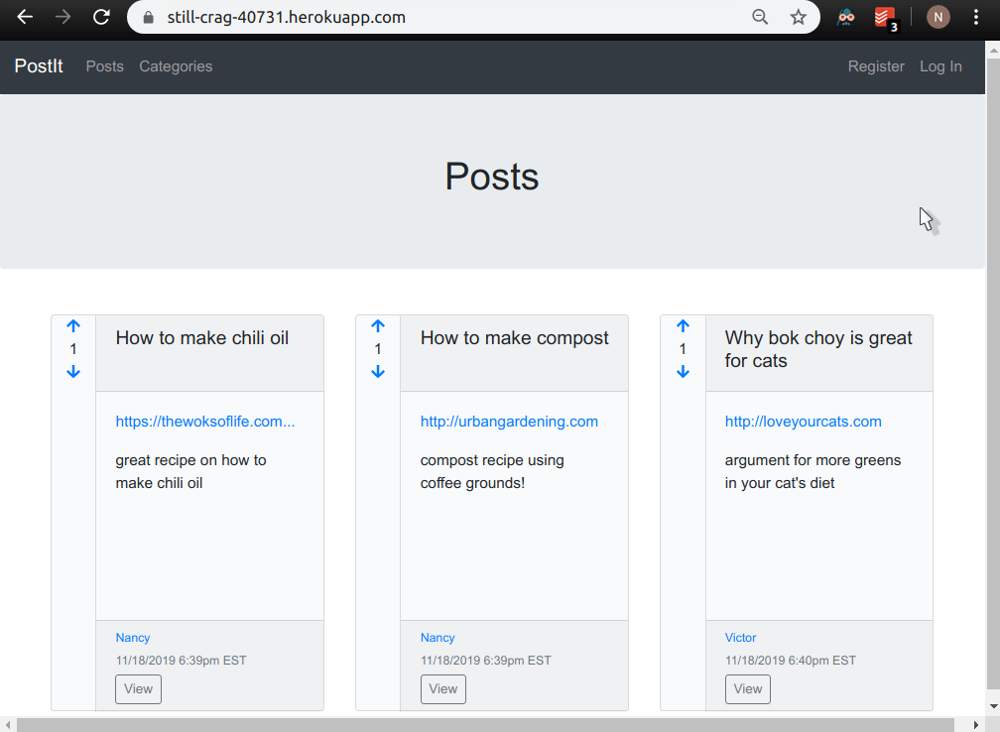

# Lesson 4
At the end of the lesson, the app will use Ajax to submit votes and refresh the vote count for the object that was voted on, extract the voting code from the models to a Ruby gem, add slugging and roles, use Eastern US time as the default time, and let users choose which time zone to use.  

Demo:


## Table of Contents

* [Course Instructions](#course-instructions)
   * [Ajax-ify voting and extract code to a Gem](#ajax-ify-voting-and-extract-code-to-a-gem)
   * [Use slugs](#use-slugs)
   * [Add roles](#add-roles)
   * [Let users set time zones](#let-users-set-time-zones)
* [What I Changed](#what-i-changed)
   * [Ajax-ify Voting](#ajax-ify-voting)
   * [Use Slugs](#use-slugs-1)
* [What I Added](#what-i-added)
* [Ajax-ify Voting](#ajax-ify-voting-1)
   * [Modify the vote actions to serve the Ajax request](#modify-the-vote-actions-to-serve-the-ajax-request)
   * [Enable usage of jQuery](#enable-usage-of-jquery)
   * [Modify vote partial](#modify-vote-partial)
   * [Create javascript templates](#create-javascript-templates)
* [Extract voting code to a Gem](#extract-voting-code-to-a-gem)
* [Use slugs](#use-slugs-2)
   * [Add slug column to posts, categories, and users tables](#add-slug-column-to-posts-categories-and-users-tables)
   * [Create module](#create-module)
   * [Update models](#update-models)
   * [Update controllers](#update-controllers)
   * [Update views](#update-views)
      * [Posts](#posts)
* [Categories](#categories)
* [Users](#users)
   * [Fill in slugs for existing rows](#fill-in-slugs-for-existing-rows)
   * [Deploy](#deploy)
* [Add roles](#add-roles-1)
   * [Add a role column to the users table](#add-a-role-column-to-the-users-table)
   * [Add methods to the User model](#add-methods-to-the-user-model)
   * [Add restrictions to controllers](#add-restrictions-to-controllers)
      * [ApplicationController](#applicationcontroller)
      * [CategoriesController](#categoriescontroller)
   * [PostsController](#postscontroller)
   * [UsersController](#userscontroller)
   * [Update views](#update-views-1)
* [Let users set time zones](#let-users-set-time-zones-1)
   * [Set default time zone to Eastern time](#set-default-time-zone-to-eastern-time)
   * [Add a time_zone column to the users table](#add-a-time_zone-column-to-the-users-table)
   * [Add a dropdown field for time zone to new user form](#add-a-dropdown-field-for-time-zone-to-new-user-form)
   * [Modify strong params to allow time_zone through](#modify-strong-params-to-allow-time_zone-through)
   * [Modify display_datetime in ApplicationHelper](#modify-display_datetime-in-applicationhelper)
* [Additional Changes](#additional-changes)

Created by [gh-md-toc](https://github.com/ekalinin/github-markdown-toc)


## Course Instructions
### Ajax-ify voting and extract code to a Gem
- When an object is voted on, refresh the total votes shown for the object, not the entire page.
- Extract the voting code in the models to a Gem. 
### Use slugs
- URLs should contain the title of posts, usernames of users, and names of categories, instead of ids.
- Replace all non-alphanumeric characters with a dash, and with multiple dashes in a row with a single dash
- Append a number to a new slug if it is identical to an existing one.
### Add roles
- Restrict creation of categories to admin role.
- Only show the link to create a new category to admins.
- Restrict editing of posts to their creator and admins.
### Let users set time zones
- Add a drop-down of time zones to the user form (new and edit).
- Make the default time zone Eastern US time.
- Allow each user to select their time zone.

## What I Changed
### Ajax-ify Voting
In the previous lesson, I added code to handle the following scenarios:
  - If a user has already voted, I gray out the arrow corresponding to the vote the user made on the object, and do nothing if the user clicks on it (it's not even a link anymore, just an icon).
  - If a user has already voted, I allow the user to change their vote. If they click on the other arrow, I update their vote in the database. I do not create a new vote.
Because of these changes, my code deviates from that in the course videos.

### Use Slugs
- I wrote my own function to handle duplicate slugs. 

## What I Added

## Ajax-ify Voting
### Modify the `vote` actions to serve the Ajax request
Replace the `redirect_back` line with this snippet in PostsController and CommentsController. This will render `app/views/posts/vote.js.erb` for posts and `app/views/comments/vote.js.erb` for comments when the request is sent using Ajax. [(Docs)](https://guides.rubyonrails.org/working_with_javascript_in_rails.html#a-simple-example)
```ruby
@upvote = params[:vote]

respond_to do |format|
  format.html do
    redirect_back fallback_location: root_path
  end
  format.js
end
```

### Enable usage of jQuery 
Add the following lines to `app/javascript/packs/application.js`:
```
window.jQuery = $;
window.$ = $;
```

### Modify `vote` partial 
- Set the `:remote` option of `link_to` to `true` to set the `data-remote` attribute of the resulting anchor tag to `true`. JavaScript code that comes with Rails will see this and send the request using Ajax. [(Docs)](https://guides.rubyonrails.org/working_with_javascript_in_rails.html#link-to)
- Wrap the total votes display in a `span` element and dynamically generate ids for the element so we can reference them easily in the DOM.
- Add classes to the `upvote` and `downvote` parts so we can reference them easily in the DOM.

```
# app/views/shared/_vote.html.erb 

<% if obj.class == Post %>
  <% url_true = vote_post_path(obj, vote: true) %>
  <% url_false = vote_post_path(obj, vote: false) %>
<% elsif obj.class == Comment %>
  <% url_true = vote_post_comment_path(obj.post, obj, vote: true) %>
  <% url_false = vote_post_comment_path(obj.post, obj, vote: false) %>
<% end %>

<span class='upvote'>
  <% if !current_user || obj.votes.where(user_id: current_user.id, vote: true).empty? %>
    <%= link_to url_true, method: 'post', remote: true do %>
      <%= fa_icon 'arrow-up' %>
    <% end %>
  <% else %>
    <%= fa_icon 'arrow-up', class: 'disabled' %>
  <% end %>
</span>
<div id='<%= obj.class %>_<%= obj.id %>_votes'><%= obj.total_votes %></div>
<span class='downvote'>
  <% if !current_user || obj.votes.where(user_id: current_user.id, vote: false).empty? %>
    <%= link_to url_false, method: 'post', remote: true do %>
      <%= fa_icon 'arrow-down' %>
    <% end %>
  <% else %>
    <%= fa_icon 'arrow-down', class: 'disabled' %>
  <% end %>
</span>
```

### Create javascript templates
I don't know how to DRY this up yet.
```
// app/views/posts/vote.js.erb

$total_votes = $('#<%= @post.class %>_<%= @post.id %>_votes');
$total_votes.text(<%= @post.total_votes %>);
$upvote = $total_votes.siblings('.upvote');
$downvote = $total_votes.siblings('.downvote');

if (<%= @upvote %>) {
  $upvote.html('<i><i class="fas fa fa-arrow-up disabled"></i>');
  $downvote.html('<%= link_to(vote_post_path(@post, vote: false), method: 'post', remote: true) {|x| fa_icon 'arrow-down'} %>');
} else {
  $downvote.html('<i><i class="fas fa fa-arrow-down disabled"></i>');
  $upvote.html('<%= link_to(vote_post_path(@post, vote: true), method: 'post', remote: true) {|x| fa_icon 'arrow-up'} %>');
}
```

```
// app/views/comments/vote.js.erb

$total_votes = $('#<%= @comment.class %>_<%= @comment.id %>_votes');
$total_votes.text(<%= @comment.total_votes %>);
$upvote = $total_votes.siblings('.upvote');
$downvote = $total_votes.siblings('.downvote');

if (<%= @upvote %>) {
  $upvote.html('<i><i class="fas fa fa-arrow-up disabled"></i>');
  $downvote.html('<%= link_to(vote_post_comment_path(@comment, vote: false), method: 'post', remote: true) {|x| fa_icon 'arrow-down'} %>');
} else {
  $downvote.html('<i><i class="fas fa fa-arrow-down disabled"></i>');
  $upvote.html('<%= link_to(vote_post_comment_path(@comment, vote: true), method: 'post', remote: true) {|x| fa_icon 'arrow-up'} %>');
}
```

## Extract voting code to a Gem 
- Register at rubygems.org.
- `gem install gemcutter`
- Create new folder `voteable_gem` (NOT in the same folder as the app; it should have its own git repo).
- Create a gem specification file in the folder.
```
# voteable-gem/voteable_nancy.gemspec

Gem::Specification.new do |s|
  s.name = 'voteable_nancy'
  s.version = '0.0.0'
  s.date = '2019-11-22'
  s.summary = 'A voting gem'
  s.description = 'My voting gem.'
  s.authors = ['Nancy Trinh']
  s.email = ['nancy@ls.com']
  s.files = ['lib/voteable_nancy.rb']
  # normally you would want your code in a git repo and you would put the link here
  s.homepage = 'http://github.com' 
end
```
- Create `voteable-gem/lib/voteable_nancy.rb`
```ruby
module Voteable
  extend ActiveSupport::Concern

  included do
    # run this at inclusion time
    has_many :votes, as: :voteable
  end

  def total_votes
    self.upvotes - self.downvotes  
  end

  def upvotes
    self.votes.where(vote: true).size
  end

  def downvotes
    self.votes.where(vote: false).size
  end
end
```
- Remove the code you copied to voteable_nancy.rb from the Post and Comment models. Replace with `include Voteable`.
- `gem build voteable_nancy.gemspec`
- `gem push voteable_nancy-0.0.0.gem`
- Add `include Voteable` to Post model and Comment model 
- Add `gem 'voteable_nancy', '~> 0.0.0'` in Gemfile. (Change the version number every time you update the version, rebuild, and push).
- `bundle install`
- If you want to work on the gem locally as you develop your application, you can specify the path in the Gemfile: `gem 'voteable_nancy', '~> 0.0.0', path: '/home/nancy/Documents/voteable_gem'`. You would still have to `gem build voteable_nancy.gemspec` every time you change the version number.

## Use slugs
I suggest adding slug functionality to `posts`, `categories`, and `users` one at a time, checking in the UI and deploying as you go, to make it easier to catch any bugs as they are introduced.
### Add `slug` column to `posts`, `categories`, and `users` tables
`rails g migration add_slugs`
```
def change
  add_column :posts, :slug, :string
  add_column :categories, :slug, :string
  add_column :users, :slug, :string
end
```
`rails db:migrate`

### Create module 
```
# config/initializers/sluggable.rb
module Sluggable
  extend ActiveSupport::Concern

  included do
    before_save :generate_slug!
    # expose a class attribute that we can set per class that we include Sluggable in
    class_attribute :slug_column
  end

  # overrides the to_param method so the path helpers
  # (e.g., post_path(post)) would use the slug column to build the url
  def to_param
    self.slug 
  end

  def generate_slug!
    slug = to_slug(self.send(self.class.slug_column.to_sym))
    obj = self.class.find_by slug: slug
    if obj && obj != self
      self.slug = next_slug(slug)
    else
      self.slug = slug
    end
  end
  
  def to_slug(str)
    str = str.strip
    str.gsub! /\s*[^A-Za-z0-9]\s*/, '-'
    str.gsub! /-+/, '-'
    str.downcase
  end

  def next_slug(slug)
    number = 1
    new_slug = ''
    loop do
      new_slug = "#{slug}-#{number}"
      obj = self.class.find_by slug: new_slug 
      break if obj.nil?
      number += 1
    end
    new_slug 
  end

  module ClassMethods
    def sluggable_column(col_name)
      self.slug_column = col_name
    end
  end
end
```

### Update models
- Add `include Sluggable` to post, category, and user models 
- Set `sluggable_column :title` in the post model.
- Set `sluggable_column :name` in the category model.
- Set `sluggable_column :username` in the user model.

### Update controllers
- Update `set_post` in PostsController to use `@post = Post.find_by slug: params[:id]`
- Update `create` in CommentsController to use `@post = Post.find_by slug: params[:post_id]`
- Update `show` action in CategoriesController to use `Category.find_by slug: params[:id]`
- Update `set_user` in UsersController to use `User.find_by slug: params[:id]`.

### Update views
#### Posts
```
# app/views/posts/show.html.erb

# @post.comments.each => @post.reload.comments.each
# because when you have a validation error, you want to reload
# the post and then grab the comments associated with it.
```

```
# app/views/posts/vote.js.erb

# post.id => post.slug
```

```
# app/views/shared/_vote.html.erb

# obj.id => obj.slug only if the object being voted on is a post.

<% obj_identifier = (obj.class == Post ? obj.slug : obj.id) %>

<div id='<%= obj.class %>_<%= obj_identifier %>_votes'><%= obj.total_votes %></div>
```

## Categories
```
# posts/_form.html.erb

TODO: use slugs for categories
Right now they show up as:

<label class="checkbox inline mx-2" for="post_category_ids_7"><input class="checkbox mr-1" type="checkbox" value="7" name="post[category_ids][]" id="post_category_ids_7">Recipes</label>
```

## Users
```
# app/views/shared/_nav.html.erb

# current_user.id => current_user.slug
```

```
# app/views/shared/_header.html.erb

# obj.id => obj.slug for edit_user_path
```

```
# app/views/shared/_creator_details.html.erb

# obj.creator.id => obj.creator.slug for user_path
```

### Fill in slugs for existing rows 
Run the following commands in rails console to generate slugs for each user, post, and category. If there are any rollbacks, this means some rows do not pass validations, and you will have to fix them first.
```
User.all.each {|x| x.save}
Post.all.each {|x| x.save}
Category.all.each {|x| x.save}
```

### Deploy
`heroku rake db:migrate`
`heroku run rails console`
```
User.all.each {|x| x.save}
Post.all.each {|x| x.save}
Category.all.each {|x| x.save}
```

## Add roles
### Add a `role` column to the `users` table
`rails g migration add_role_to_users`
```
def change
  add_column :users, :role, :string
end
```
`rails db:migrate`

### Add methods to the User model
```
def admin?
  self.role == 'admin'
end

def moderator?
  self.role == 'moderator'
end
```

### Add restrictions to controllers
#### ApplicationController
```
def require_admin
  access_denied unless logged_in? && current_user.admin?
end

def access_denied
  flash[:error] = 'You do not have permission to do that.'
  redirect_to root_path
end
```

#### CategoriesController
`before_action :require_admin, only: [:new, :create]`

### PostsController
Replace `require_same_user` and the `before_action` associated with it, with the following:
```
before_action :require_creator_or_admin, only: [:edit, :update] 

def require_creator_or_admin
  access_denied unless logged_in? && (current_user == @post.creator || current_user.admin?)
end
``` 

### UsersController
Remove `require_same_user` method since it has been moved to ApplicationController.

### Update views
Hide new category link unless the current user is an admin.
```
# app/views/shared/_nav.html.erb

<% if current_user.admin? %>
<% end %>
```
Hide link to edit a post unless the current user is an admin or the creator of the post.
```
# app/views/posts/_post.html.erb 

<% if logged_in? && (current_user.admin? || (current_user == post.creator)) %>
<% end %>
```

```
# app/views/shared/_header.html.erb

# when the obj passed in is a post 
<% can_edit = (current_user.admin? || (current_user == obj.creator)) %>
```

## Let users set time zones
### Set default time zone to Eastern time
```
# config/locales/application.rb

config.time_zone = 'Eastern Time (US & Canada)'
```

### Add a `time_zone` column to the `users` table
`rails g migration add_time_zone_to_users` 
```
def change
  add_column :users, :time_zone, :string
end
```
`rails db:migrate`

### Add a dropdown field for time zone to new user form
```
# app/views/users/_form.html.erb

<div class='form-group'>
  <%= f.label :time_zone %>
  <div>
  <%= f.time_zone_select :time_zone, ActiveSupport::TimeZone.us_zones, default: Time.zone.name %>
  </div>
</div>
```

### Modify strong params to allow `time_zone` through
`params.require(:user).permit(:username, :password, :time_zone)`

### Modify `display_datetime` in ApplicationHelper
```
# helpers/application_helper.rb

def display_datetime(dt)
  if logged_in? && !current_user.time_zone.blank?
    dt = dt.in_time_zone(current_user.time_zone)
  end
  dt.strftime("%m/%d/%Y %l:%M%P %Z")
end
```
- 1:35: display timezone on user's profile page
```
# app/views/shared/_header.html.erb

<% if obj.class == User %>
  <p><%= obj.time_zone || Time.zone.name %></p> 
<% end %>
```

## Additional Changes
- Add right border for the voting aside.
  ```
  # app/javascript/stylesheets/_custom.scss
  
  .votes {
    border-right: 1px solid rgba(0, 0, 0, 0.125);
  }
  ```
- Fix formatting of creator_details so if the username is long the display still looks nice.
```
# app/views/shared/_creator_details.html.erb

<% user_url = user_path(obj.creator.slug) %>
<% created_at = " #{display_datetime(obj.created_at)}" %>

<p><small class="text-muted"><%= link_to(obj.creator.username, user_url)%></small></p>
<p><small class="text-muted"><%= created_at %></small></p>
```

```
# app/javascript/stylesheets/_custom.scss

.post {
  .card-footer {
  height: 6rem;
  padding-top: 0.3rem;
  p {
      margin-bottom: 0;
    }
  nav {
      padding-top: 0.2rem; 
    }
  }
}
```
- Restrict lengths of username and password to 50 characters.
```
# app/models/user.rb

validates :username, presence: true, uniqueness: true, length: {maximum: 50}
validates :password, presence: true, on: :create, length: {minimum: 5, maximum: 50}
```
